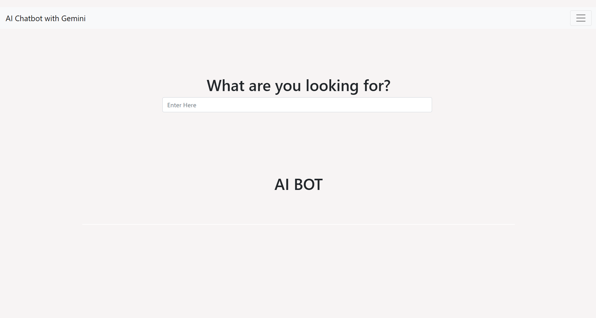
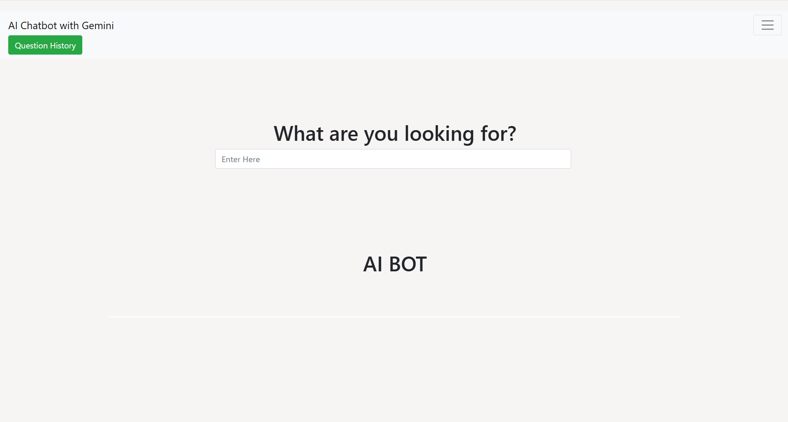
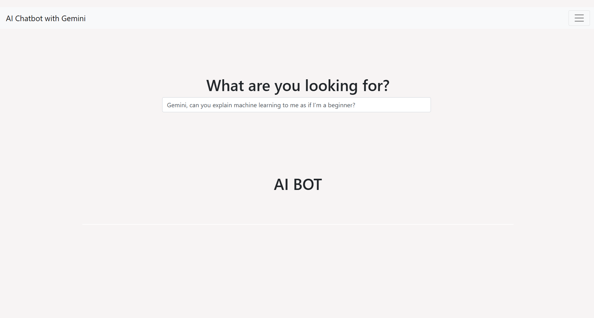
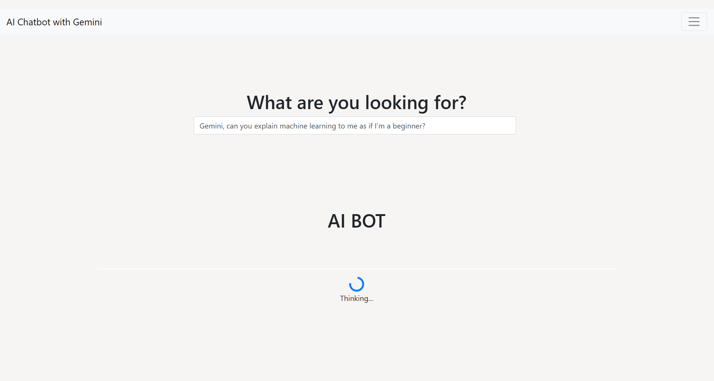
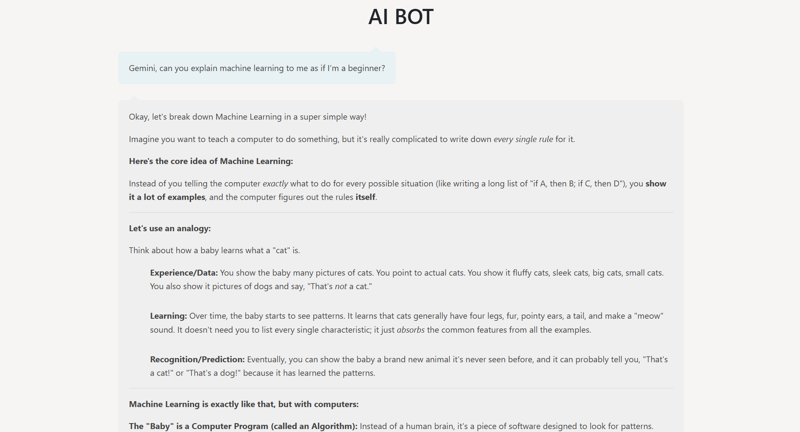
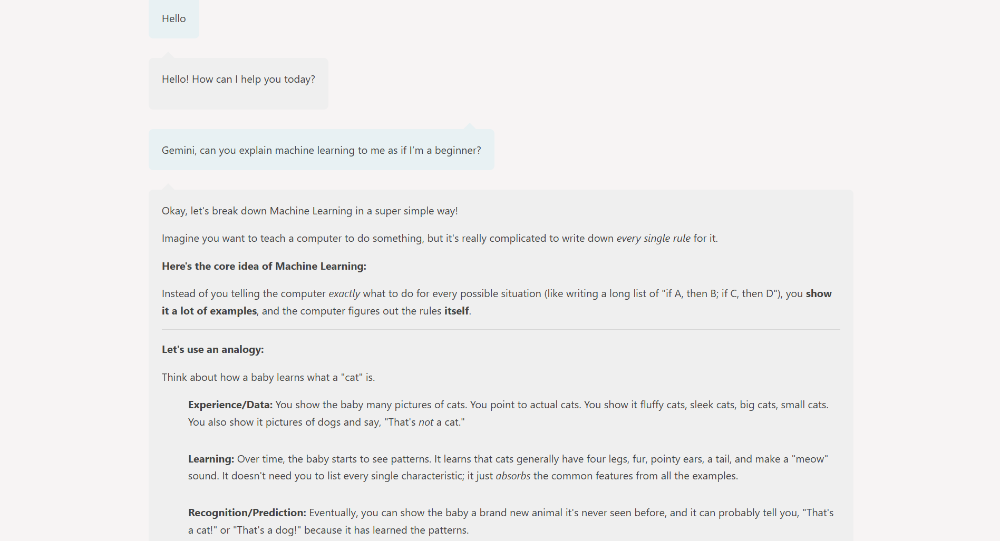

# Gemini-Powered AI Chatbot (Flask)

A lightweight AI chatbot built with **Flask** and **Google Gemini**.  
This project integrates Gemini responses into a clean web UI, includes a simple chat history view, and uses a modular Flask backend.

---

## 🚀 Features

- Chatbot powered by **Gemini 2.5 Flash** (configurable)
- Clean Bootstrap-based UI
- Markdown-rendered responses
- Search-style message input + loading spinner
- Basic in-memory chat history
- Flask Blueprints for modularity
- Secure `.env` handling for API keys

---

## 📸 Project Screenshots

### 🔹 Home Screen









### 🔹 Chatbot in Action



### 🔹 Question History View



---

## 📁 Project Structure

```
gemini-flask-chatbot/
│
├── flaskapplication/
│   ├── app.py
│   ├── database.db            # ignored by Git
│   ├── .env                   # ignored by Git (user adds API key here)
│   │
│   ├── website/
│   │   ├── __init__.py
│   │   ├── routes.py
│   │   ├── models.py
│   │   │
│   │   ├── templates/
│   │   │   ├── base.html
│   │   │   ├── response_view.html
│   │   │   └── history.html
│   │   │
│   │   └── static/
│   │       └── mainpage.css
│   │
│
├── .venv/                     # virtual environment (ignored by Git)
├── .gitignore
├── requirements.txt
└── README.md
```

---

## 🔧 Setup & Installation

### **1. Clone the repository**

```bash
git clone https://github.com/emmadismail/gemini-flask-chatbot.git
cd gemini-flask-chatbot
```

### **2. Create and activate a virtual environment**

```bash
python -m venv .venv
.\.venv\Scripts\activate   # Windows
```

### **3. Install project dependencies**

```bash
pip install -r requirements.txt
```

### **4. Add your Gemini API key**

Create a file at:

```
flaskapplication/.env
```

Inside the `.env` file, add:

```
Gemini_api_key=<YOUR_API_KEY>
```

⚠ **Do NOT commit your real API key.**  
The `.env` file is already listed in `.gitignore`.

---

## ▶ Running the Application

From the root folder:

```bash
cd flaskapplication
python app.py
```

Then open the browser at:

```
http://127.0.0.1:5000
```

---

## 🧠 Model Configuration

The model can be changed inside:

```
flaskapplication/website/routes.py
```

Example:

```python
model = genai.GenerativeModel("gemini-2.5-flash")
```

Other valid models include `"gemini-pro"`.

---

## 🛡 License

This project uses the **MIT License**.  
See the LICENSE file for full details.

---

## ✨ Author

Developed by **Emmad Ismail**.  
If you find this project helpful, feel free to ⭐ the repository.
